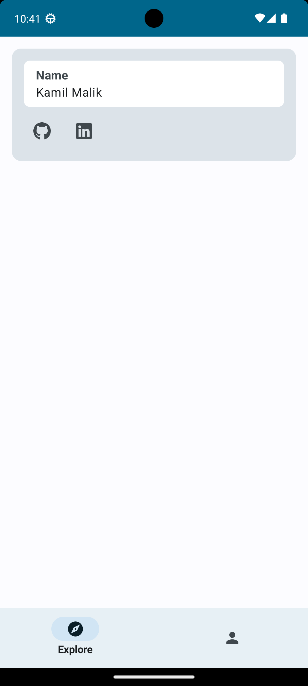

# Finsem Marketplace (Final Semester Marketplace)

Finsem Marketplace is your go-to app for finding the perfect mentor to guide you through your final project or thesis. Whether you're a student in need of guidance or an instructor eager to sell your expertise, our platform makes it simple to connect and collaborate.

# Authentication
You can create a new account via our register screen or login to existing account via our login screen.
<table>
  <tr>
    <td></td>
    <td></td>
  </tr>
</table>

# Main Screen
You can see all the seller available on platform via explore section and edit your profile as a seller in Profile Section
<table>
  <tr>
    <td></td>
    <td></td>
  </tr>
</table>

# Firebase Structure
{
  "name": "John Doe",
  "role": 1,
  "email": "john@example.com",
  "url_github": "https://github.com/johndoe",
  "url_linkedin": "https://www.linkedin.com/in/johndoe",
  "whatsapp_number": "+1234567890"
}
